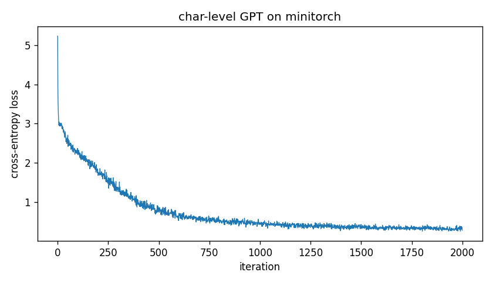
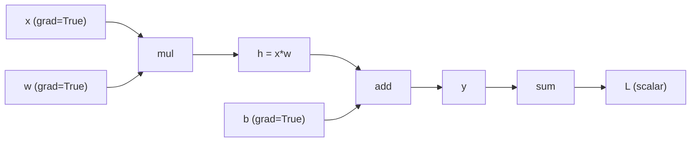

# MiniTorch

A PyTorch clone I built from scratch to learn how autograd and neural networks work under the hood. It runs reverse-mode autodiff on NumPy and adds a module system, conv nets, and a GPT-style transformer that all share one autograd core.

The whole thing is ~1200 lines of NumPy (run `python sz.py` for the breakdown); the autograd engine is ~410. It's meant to be read: see the [reading guide](https://samitmohan.github.io/minitorch/reading-guide/).

[Docs](https://samitmohan.github.io/minitorch/)

## What's in here

- Reverse-mode autograd with an iterative topological sort (handles deep graphs)
- Tensor with broadcasting, slicing, reductions, and batched matmul
- Module system (parameters, train/eval, state_dict, save/load)
- Layers: Linear, Conv2d, MaxPool2d, BatchNorm1d, LayerNorm, Embedding, Dropout, ReLU, GELU, Sigmoid, Tanh, Softmax
- A GPT-style transformer (multi-head attention, causal masking) trained on character-level text
- SGD (momentum) and Adam; StepLR and CosineAnnealingLR schedulers
- Cross-entropy, MSE, and binary cross-entropy loss
- Numerical gradient checking with finite differences
- Computation graph visualization, DataLoader, gradient clipping

## Results

| Task | Model | Result |
|------|-------|--------|
| MNIST | MLP (784-128-10), 8 epochs | 94.1% test accuracy |
| MNIST | CNN (2 conv + FC), 3 epochs | 95.8% test accuracy |
| Char-level LM | GPT, 107k params, 2000 iters | loss 5.24 to 0.28 |

The transformer trains on an embedded snippet of *Alice in Wonderland* using only NumPy:



After 2000 iterations it samples text that echoes the source. It works at the character level, so a few words come out mangled:

```
Alice taros the field after
it, and fortunately was just in time to seee it pop down a large rabbit-hole under the
hedered tofer feet, for it flashed acrosss
her mind that she had never before seen a r
```

## How autograd works

Each op records its inputs and a backward closure. `.backward()` sorts the graph topologically and walks it in reverse, applying the chain rule.



Full walkthrough in the [How It Works](https://samitmohan.github.io/minitorch/how-it-works/) docs.

## Benchmark

Linear regression, 100 epochs, 100 samples (`benchmark.py`):

| Backend | Time |
|---------|------|
| NumPy (hand-written grads) | ~0.6 ms |
| MiniTorch | ~3 ms |
| PyTorch | ~12 ms |

On a problem this small, the cost is per-op Python overhead, not math. PyTorch's kernels don't help here, so raw NumPy is fastest and MiniTorch lands in the middle. PyTorch's advantage shows on large tensors where BLAS and kernel fusion matter. See the [Performance](https://samitmohan.github.io/minitorch/performance/) page.

## Setup

```bash
git clone https://github.com/samitmohan/minitorch.git
cd minitorch
uv pip install -e .
```

## Run

```bash
# regression demo
uv run python train.py

# MNIST
uv run python mnist_example.py --model mlp --epochs 15
uv run python mnist_example.py --model cnn --epochs 10 --n-train 2000

# character-level transformer
uv run python char_transformer.py --iters 2000 --plot loss.png

# streamlit playground
uv run --extra app streamlit run app.py

# docs
uv run --extra docs mkdocs serve
```

## License

MIT
