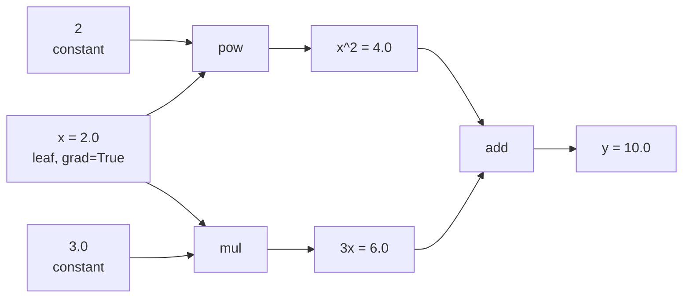

# How It Works

This page walks through what MiniTorch does under the hood when you call `.backward()`.

---

## The idea

Every time you do math on a `Tensor`, MiniTorch records the operation in a graph. Each tensor knows what operation created it and which tensors were the inputs. When you call `.backward()`, it walks this graph in reverse and applies the chain rule to compute gradients.

This is called **reverse-mode automatic differentiation**.

---

## Step by step: `y = x^2 + 3x`

```python
from minitorch import Tensor

x = Tensor(2.0, requires_grad=True)
y = x ** 2 + 3.0 * x
y.backward()
print(x.grad)  # 7.0
```

Here is what happens internally:

### Forward pass

Each operation creates a new tensor and records its parents:



The tensors store their parents in `_prev` and the operation name in `_op`. Each one also stores a `_backward` closure that knows how to push gradients to its inputs.

### Backward pass

Calling `y.backward()` does two things:

**1. Topological sort** - walk the graph and order nodes so that every node comes after its children:

```
[x, Tensor(2), Tensor(3.0), x^2, 3x, y]
```

**2. Reverse walk** - process nodes from `y` back to `x`, calling each `_backward`:

| Step | Node | Operation | Gradient pushed |
|------|------|-----------|----------------|
| 1 | `y` | seed | `y.grad = 1.0` |
| 2 | `y` (add) | `add._backward()` | `x^2.grad += 1.0`, `3x.grad += 1.0` |
| 3 | `3x` (mul) | `mul._backward()` | `x.grad += 3.0 * 1.0 = 3.0` |
| 4 | `x^2` (pow) | `pow._backward()` | `x.grad += 2 * 2.0 * 1.0 = 4.0` |

Final result: `x.grad = 3.0 + 4.0 = 7.0`

This matches the derivative: d/dx(x^2 + 3x) = 2x + 3 = 2(2) + 3 = 7.

---

## The backward closures

Each operation defines a `_backward` function as a closure that captures its inputs. Here is what the `__mul__` backward looks like:

```python
def __mul__(self, other):
    out = Tensor(self.data * other.data)

    def _backward():
        # d(a*b)/da = b, d(a*b)/db = a
        self.grad += other.data * out.grad
        other.grad += self.data * out.grad

    out._backward = _backward
    out._prev = {self, other}
    return out
```

The closure captures `self`, `other`, and `out`. When called during the backward pass, it already has access to everything it needs.

---

## Broadcasting gradients

When shapes differ during an operation (e.g. adding a `(3,4)` tensor with a `(4,)` tensor), NumPy broadcasts the smaller one. During backward, we need to reverse this: sum the gradient along the axes that were broadcast.

```python
def _sum_to_shape(grad, shape):
    # remove extra leading dims
    while grad.ndim > len(shape):
        grad = grad.sum(axis=0)
    # collapse broadcast dims
    for i, (g, s) in enumerate(zip(grad.shape, shape)):
        if s == 1 and g != 1:
            grad = grad.sum(axis=i, keepdims=True)
    return grad
```

---

## Visualizing the graph

You can render any computation graph using `draw_graph`:

```python
from minitorch import Tensor, draw_graph

x = Tensor(2.0, requires_grad=True)
y = x ** 2 + 3.0 * x

dot = draw_graph(y)
dot.render('graph', format='png')  # saves graph.png
```

This requires the `graphviz` Python package:

```bash
uv pip install graphviz
```

Green nodes have `requires_grad=True`, gray are constants, blue boxes are operations.

---

## What makes this different from PyTorch

The core algorithm is the same: build a DAG during forward, reverse-walk it during backward. The differences are all about performance:

- MiniTorch creates Python objects for every intermediate tensor. PyTorch uses C++ objects.
- MiniTorch stores closures for backward. PyTorch uses compiled autograd functions.
- MiniTorch does one NumPy call per operation. PyTorch fuses operations and uses optimized BLAS kernels.

See the [Performance](performance.md) page for more on this.
